# vhliboptimal


---

| Header               | Description                       |
|----------------------|-----------------------------------|
| Project              | VHLibOptimal                      |
| Description          | C++ library for shape contour detection and image outline recognition |
| Current Version      | 0.7.0-beta (2026)                 |
| Development started  | 2006                              |
| Major C++23 rewrite  | 2025 - 2026                       |
| Author               | V01G04A81 / Viktor Glebov         |
| License              | MIT                               |
| Source code          | [https://github.com/vigatron/vhliboptimal](https://github.com/vigatron/vhliboptimal) |

<br>

***A high-performance C++23 library for fast shape contour detection and image outline recognition using optimized grid-based scanning.***


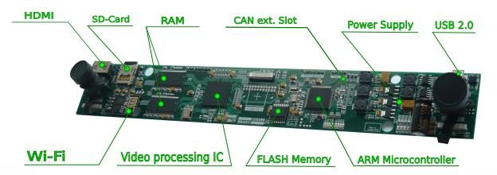

*Historical reference: The 2016 FPGA-based stereo vision system that proved the algorithm's real-time viability on dual-camera setups.*

*The core algorithm, originally developed in 2006, received a complete modern C++23 rewrite in 2025–2026. This version brings a clean object-oriented interface for single-camera Single Board Computer setups while preserving two decades of embedded efficiency lessons.*

---

## Project Overview


`vhliboptimal` is a high-performance C++23 library for fast shape contour detection and image outline recognition.  

Originally developed in plain C (starting in 2006) for commercial embedded projects on ARM and AVR platforms.

Later evolved through an FPGA-accelerated era (2016).

It has been completely modernized in 2026 with a clean object-oriented C++23 interface while preserving its efficiency-focused philosophy.  

It uses an optimized grid-based approach: the image is divided into a configurable **Cells Matrix**, and connectivity is tracked using compact **BitFields**.  

This design delivers excellent performance with very low memory and CPU usage, making it ideal for embedded systems and real-time applications.  

Unlike general-purpose computer vision frameworks such as OpenCV, `vhliboptimal` focuses exclusively on contour extraction and therefore remains lightweight and easy to integrate.

It excels at processing binary or high-contrast images and gracefully handles small gaps and noise thanks to tunable parameters.  

---

## Key Features

* Zero heavy third-party dependencies (OpenCV, etc.)
* Built on a lightweight, dedicated platform layer (vhlibplatform)
* Three raw C-style callbacks for maximum interoperability (C, Python, Rust FFI-friendly) and predictable execution behavior
* Support for multiple image sources via `srcimgid`
* Highly optimized grid-based scanning with bit-packing
* Configurable cell size and noise tolerance
* Real-time contour and content processing via callbacks
* Modern C++ interoperability: While exposing raw C-style callbacks for maximum FFI compatibility (C, Python, Rust), the internal architecture is designed to leverage modern C++ features (e.g., `std::invoke` patterns) for flexible and type-safe execution.

---

### Road Signs Recognition Example

The examples below demonstrate how `vhliboptimal` is utilized within a real-world road sign recognition application. 

In this specific pipeline, the library is responsible **exclusively** for the high-speed, deterministic extraction of shape contours and internal spans from pre-processed frames. The extracted geometric data is then passed to a higher-level classification module.

##### Example #1

<table>
  <tr>
    <td align="center">
      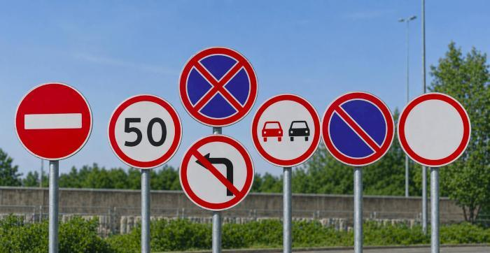
    </td>
    <td align="center">
      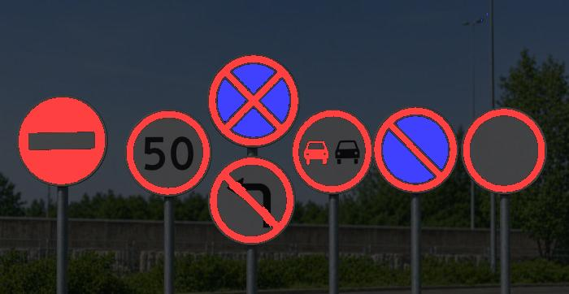
    </td>
    <td align="center">
      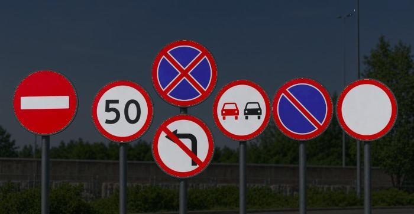
    </td>
  </tr>
</table>

<table>
  <tr>
    <td align="center">
      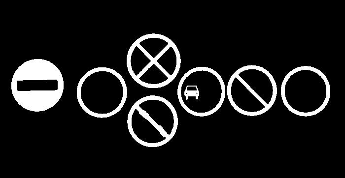
    </td>
    <td align="center">
      
    </td>
    <td align="center">
      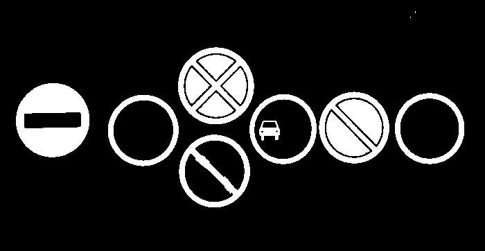
    </td>
  </tr>
</table>

##### Example #2

<table>
  <tr>
    <td align="center">
      
    </td>
    <td align="center">
      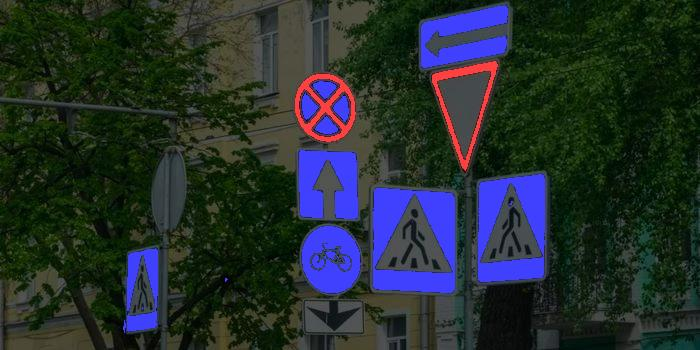
    </td>
    <td align="center">
      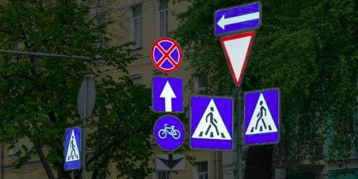
    </td>
  </tr>
</table>

<table>
  <tr>
    <td align="center">
      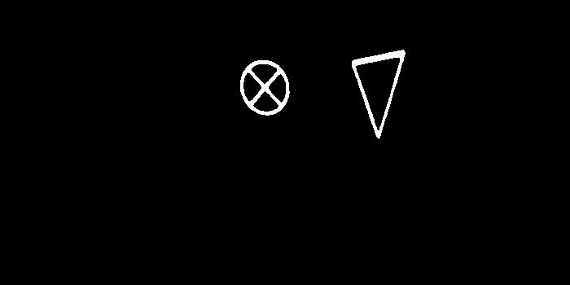
    </td>
    <td align="center">
      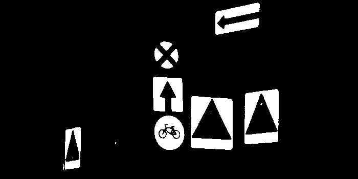
    </td>
    <td align="center">
      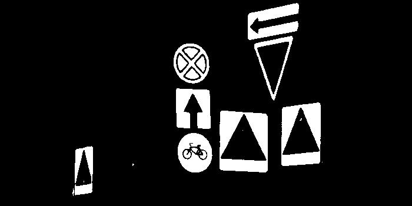
    </td>
  </tr>
</table>


---

## History & Evolution

The `vhliboptimal` library has deep roots in real-world embedded computer vision, evolving from extreme hardware constraints to modern software efficiency.

#### 2006 - The Extreme Embedded Roots (AVR + External SRAM)

The algorithm originated as a raster-to-vector engine for 8-bit AVR microcontrollers, initially tasked with recognizing character contours and geometric shapes on tiny 128x64 B&W displays. To handle image processing, the system utilized 32KB of external SRAM accessed via a multiplexed bus (74HC573 + ALE). The core engineering challenge was the severe bottleneck of the external memory bus.

#### 2010 ... 2012 — Road Signs Recognition

The grid-based `BitField` architecture was specifically designed here to minimize external bus accesses, keeping the heavy pathfinding logic strictly within the MCU's fast internal RAM. Tested on LPC2148 and AT91SAM7X256 platforms


#### 2016 — Hardware-Accelerated Era (FPGA + STM32)
As tasks grew more complex, the algorithm was scaled and integrated into a **dual-camera stereo vision** system based on a Xilinx Spartan-6 FPGA + SDRAM, paired with an STM32F7 microcontroller.

- **Proven Benchmark (2016):** Performance-critical parts in Verilog on Xilinx Spartan-6 processed shape contours from **two synchronized cameras at 60 FPS (VGA 640×480)**. 
STM32F7 handled higher-level logic. This hybrid solution delivered hard real-time performance with minimal jitter.

- The STM32 handled control logic and remaining processing in plain C. This tight parallel cooperation proved the algorithm's viability for demanding industrial robotics and automated inspection lines, where software-only solutions like OpenCV were too heavy, slow, or non-deterministic.

* **Legacy Artifact:** A surviving single-header (`.h`) version of this original plain C implementation is preserved as a historical reference at [electrolviv/optimal](https://github.com/electrolviv/optimal).


#### 2025–2026 — Modern C++23 Rewrite for SBCs

The library has been completely redesigned and rewritten from the ground up in modern **C++23**.

**The main goal** of this update was to adapt the battle-tested grid-based algorithm for today's affordable Single Board Computers (Raspberry Pi, Orange Pi, etc.), enabling real-time operation with **a single camera and pure software — no FPGA required**.

**Important trade-off:** While the 2016 FPGA implementation remains a strong reference for raw speed and determinism in core grid operations (thanks to dedicated BRAM and hardware parallelism), the new C++23 version delivers **practical real-time performance of approximately 10–25 FPS on 1080p** (depending on CPU, `cellsize` and configuration). This makes it highly suitable for edge-AI, robotics, and automated sorting tasks on widely available hardware.

It preserves the original philosophy of extreme efficiency born on 8-bit microcontrollers nearly 20 years ago, now running efficiently on general-purpose CPUs with AVX2 optimizations where available.

*The original FPGA implementation demonstrated that the algorithm maps efficiently to hardware because of its regular grid-based data flow and compact BitField representation. The modern C++23 implementation preserves the same memory-efficient architecture while targeting commodity CPUs and SBCs.*


---

## 🛠 Technical Specifications

- **Language**: C++23 (Strict requirement. *Note: Legacy C implementations for 8-bit/32-bit MCUs are not part of this codebase.*)
- **Target Platforms**: 
  - **Desktop/OS**: Linux (Primary), Windows, macOS.
  - **Modern SBCs**: Raspberry Pi, Orange Pi, and similar ARM-based boards.
  - **Modern MCUs**: STM32H7, STM32MP1, and other modern ARM Cortex-M/A cores with C++23 compiler support.
  - *(Legacy bare-metal targets like AVR or older STM32 families are not supported in this C++23 rewrite).*
- **Build System**: CMake 3.16+
- **License**: MIT
- **Author**: Viktor Glebov (V01G04A81)

---

### Dependencies
- No heavy third-party dependencies. Requires only [`vhlibplatform`](https://github.com/vigatron/vhlibplatform) — a lightweight cross-platform layer providing base primitive types, assertions, error handling, and system abstractions.

---

### Limitations & Trade-offs
- **Image Type**: Best suited for binary or high-contrast images (a direct inheritance from its B&W display origins).
- **Threading**: Currently single-threaded (multi-threading support is planned for future releases).
- **Resolution vs. Performance**: To achieve real-time FPS on SBCs, the algorithm relies on grid-based downsampling (`cellsize` 8-16px). Fine image details smaller than the configured cell size will be intentionally lost to preserve CPU cycles.
- **Memory Profile**: In the current 0.7.x beta, dynamic allocations are used during processing, making it highly efficient for SBCs (Raspberry Pi, Orange Pi) and PCs. **Strict zero-allocation (fully pre-allocated memory) for bare-metal RTOS environments is guaranteed and targeted for the stable v1.0.0 release.**


> **⚠️ Best Practices for Optimal Results**  
> The algorithm was originally proven on pristine, uncompressed RAW video streams. When using modern compressed sources (e.g., MJPEG/MP4 webcams on SBCs), compression artifacts and blurring can degrade contour accuracy.  
> 
> **Recommendation:** For best results, apply a lightweight pre-processing step (e.g., hardware-accelerated thresholding, sharpening, or edge-enhancement) before passing the frame to `vhliboptimal`, or tune `minColorVal` and `spccnt` to be more tolerant of digital noise.  


---

#### Before the startup procedure, image source parameters and settings are specified

- image width   pixels      For example 800 / 1024 / 1600 / ...
- image height  pixels      For example 600 /  768 / 1200 / ...
- cells size    pixels      For example 2 / 4 / 8 / 16 / ...

##### Additionally:
* Maximum number of figures                 (for example 128)
* Maximum number of grid particles          (for example 1024)

Or:
* Available memory size in kilobytes


##### Structure sizes

* `stspan`                     8 bytes
* `VHOptimalFigure`           16 bytes

---

#### Configuration Examples

| Параметр                          | Example #1   | Example #2    | Example #3    | Example #4      |
|-----------------------------------|--------------|---------------|---------------|-----------------|
| **Maximum number of figures**     | 128          | 128           | 128           | 128             |
| **Cell size**                     | 8 px         | 4 px          | 2 px          | 1 px            |
| **Resolution**                    | 800×600      | 800×600       | 800×600       | 800×600         |
| **Cells per frame**               | 100×75       | 200×150       | 400×300       | 800×600         |
| **Bitmask (bits)**                | 7500         | 30000         | 120000        | 480000          |
| **Bitmask (bytes)**               | 938          | 3750          | 15000         | 60000           |
| **×2 bitmasks (Global + Local)**  | 1876         | 7500          | 30000         | 120000          |
| **Memory (Worst case)**           | 60 000 bytes | 240 000 bytes | 960 000 bytes | 3 840 000 bytes |
| **Memory (Typical)**              | 16 000 bytes | 64 000 bytes  | 240 000 bytes | 960 000 bytes   |
| **+128 figures × 16**             | 2048 bytes   | 2048 bytes    | 2048 bytes    | 2048 bytes      |


---

##  Architecture & Key Components

The library operates completely abstracted from raw graphic decoders or UI frameworks (like OpenCV or `stb_image`). It processes data streams through an abstract coordinate grid:

*   **`CellsMatrix`**: Manages the spatial geometry of the grid. Images are analyzed in configurable blocks (`cellsize`), decreasing overall data dimensionality.
*   **`BitField`**: A packed bit array tracking filled/empty cells. The algorithm utilizes a **dual-bitmask architecture**: a *global mask* for the entire frame (from which figures are extracted) and a *local mask* dedicated to tracking the traversal state of the specific figure currently being processed. This eliminates the need for heavy graph data structures and keeps memory access highly predictable.
*   **`VHOptimalFigure`**: Encapsulates a single extracted shape, containing its bounding box, sorted sequential contours, and analytical span strings.


### Key Data Structures (`src/vhliboptimalstructs.hpp`)
*   `stConfig` — Scanning parameters (image boundaries, grid cell size, color thresholding tolerance `minColorVal`, and `spccnt` which defines the maximum consecutive empty cells allowed before breaking a span).
*   `strect` — Bounding box structure representation (`x1, y1` to `x2, y2`).
*   `stspan` — Horizontal/vertical segments representing the continuous boundaries of a shape.

---

## Quick Start & Integration Example

### Callbacks Architecture

The library is completely decoupled from image sources and result processing.

**1. CallbackGetSrcPxls — Fetch source image pixels**

```cpp
/**
 * CallbackGetSrcPxls - Read a horizontal line of pixels from source image
 * 
 * @param userData   User context pointer (passed through from Setup)
 * @param dstptr     Destination buffer to fill
 * @param bytescnt   Number of bytes to read
 * @param srcid      Source image ID
 * @param srcx       Starting X coordinate
 * @param srcy       Starting Y coordinate
 */
typedef void (*CallbackGetSrcPxls)(void *userData, uint8_t *dstptr, 
                                   uint16_t bytescnt, uint16_t srcid, 
                                   uint16_t srcx, uint16_t srcy);
```

**2. CallbackBorder — Process figure border (contour)**

```cpp
/**
 * CallbackBorder - Called during border tracing of a detected shape
 * 
 * @param userData   User context pointer
 * @param cmd        Command: cmdStart / cmdMove / cmdStop
 * @param dirh       Horizontal direction
 * @param dirv       Vertical direction
 * @param cellx      Cell X coordinate
 * @param celly      Cell Y coordinate
 * @param imgx       Image X coordinate (pixels)
 * @param imgy       Image Y coordinate (pixels)
 */
typedef void (*CallbackBorder)(void *userData, uint8_t cmd, uint8_t dirh, 
                               uint8_t dirv, uint16_t cellx, uint16_t celly, 
                               uint16_t imgx, uint16_t imgy);
```

**3. CallbackContent — Process horizontal spans inside the figure**

```cpp
/**
 * CallbackContent - Called for each horizontal span inside the object
 * 
 * @param userData   User context pointer
 * @param cxl        Left cell index
 * @param cxr        Right cell index
 */
typedef void (*CallbackContent)(void *userData, uint32_t cxl, uint32_t cxr);
```

### Basic Usage Example

```cpp
#include <iostream>
#include "vhliboptimal.hpp"

namespace vhliboptimal {

// Callback to fetch pixels from your framebuffer/camera
void MyGetPixels(void* userData, uint8_t* dstptr, uint16_t bytescnt,
                 uint16_t srcid, uint16_t srcx, uint16_t srcy) {
    // TODO: Fill dstptr with real image data
    // Example (dummy):
    // std::memset(dstptr, 0, bytescnt); // all black
}

// Callback for shape border tracing
void MyBorderCallback(void* userData, uint8_t cmd, uint8_t dirh, uint8_t dirv,
                      uint16_t cellx, uint16_t celly, uint16_t imgx, uint16_t imgy) {
    std::cout << "Border [cmd=" << (int)cmd 
              << ", dir=" << (int)dirh << "/" << (int)dirv 
              << "] cell(" << cellx << "," << celly 
              << ") px(" << imgx << "," << imgy << ")\n";
}

// Callback for internal content spans
void MyContentCallback(void* userData, uint32_t cxl, uint32_t cxr) {
    std::cout << "Content span: cells " << cxl << " to " << cxr << "\n";
}

} // namespace vhliboptimal

int main() {
    using namespace vhliboptimal;

    VHLibOptimal detector;

    // 1. Configuration
    stConfig cfg{};
    cfg.imageWidth   = 800;
    cfg.imageHeight  = 600;
    cfg.cellsize     = 8;      // Grid cell size in pixels
    cfg.spccnt       = 2;      // Max consecutive empty cells (noise tolerance)
    cfg.minColorVal  = 128;    // Brightness threshold

    // 2. Setup with callbacks
    verr result = detector.Setup(cfg, 
                                 MyGetPixels, 
                                 MyBorderCallback, 
                                 MyContentCallback);

    if (result != vok) {
        std::cerr << "Setup failed!" << std::endl;
        return -1;
    }

    // 3. Run processing
    detector.SetLogLevel(LOG_LEVEL_BASE);
    result = detector.Run(0);   // srcimgid = 0 (you can use multiple IDs)

    if (result == vok) {
        std::cout << "Scan completed successfully!\n";
        std::cout << "Objects found: " << detector.GetObjectsCount() << "\n";
        
        for (size_t i = 0; i < detector.GetObjectsCount(); ++i) {
            const VHOptimalFigure& fig = detector.GetObject(i);
            std::cout << "  Figure " << i 
                      << ": " << fig.SpansCount() << " spans, "
                      << "rect (" << fig.PosCells().x1 << "," 
                      << fig.PosCells().y1 << ") - ("
                      << fig.PosCells().x2 << "," 
                      << fig.PosCells().y2 << ")\n";
        }
    }

    return 0;
}
```

---

### 💡 A Fun Geek Note: 2016 FPGA vs 2025–2026 C++23 (The Branching Dilemma)

You might wonder: *How does the modern C++23 version compare to the 2016 FPGA implementation?*

The answer lies in the fundamental difference between hardware and software when dealing with **unpredictable branching** during contour tracing.

- **CPU Reality:** Tracing irregular shapes creates chaotic control flow. Branch mispredictions (15–25 cycle penalty on modern cores) and data-dependent bitwise operations on dynamic BitField indices create significant stalls. SIMD (AVX2/NEON) helps a lot during initial grid scanning, but is nearly useless in the extraction/tracing phase.

- **FPGA Advantage:** The 2016 Spartan-6 implementation used a hardware Finite State Machine and Block RAM, evaluating neighbor states with minimal latency and perfect determinism. Even at ~166 MHz, it achieved outstanding efficiency in the core loop.

**The 2026 Reality:**  
Thanks to aggressive grid downsampling, careful BitField design, and raw CPU clock speeds, the C++23 version delivers **practical real-time performance** (10–25+ FPS on 1080p) on affordable SBCs. However, the 2016 FPGA version remains superior in raw tracing latency and timing predictability.


© 2006 – 2026 V01G04A81 / Viktor Glebov
