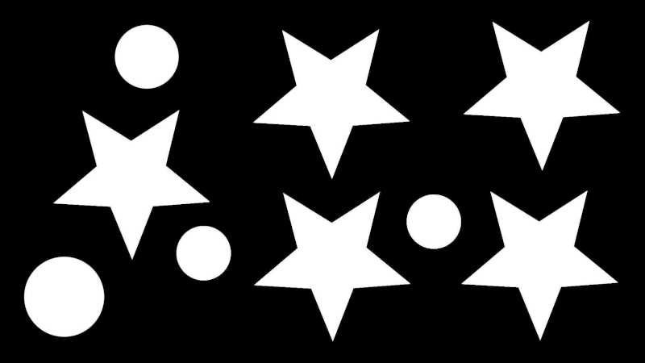
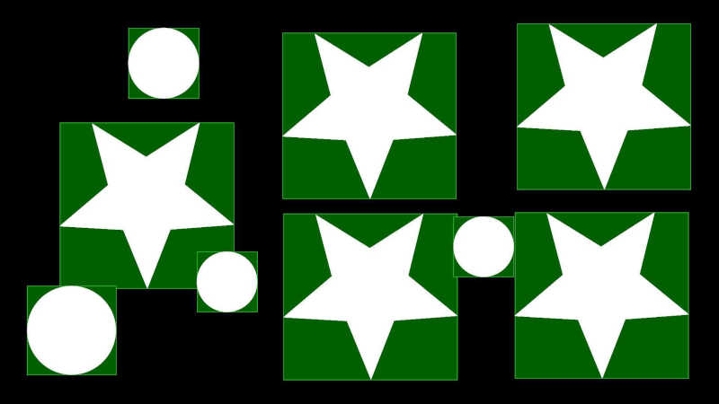
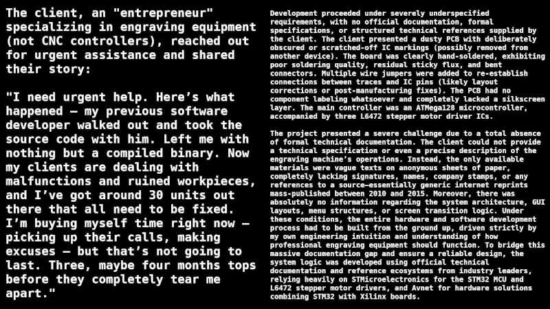
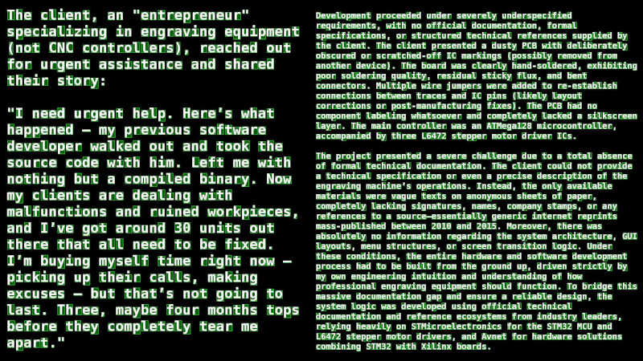

# vhliboptimal

-green.svg)

---

| Header               | Description                       |
|----------------------|-----------------------------------|
| Project              | VHLibOptimal                      |
| Description          | C++17 library for fast shape detection, object counting, and outer boundary estimation. |
| Current Version      | 0.8.0-beta (2026)                 |
| Development started  | 2006                              |
| Major C++17 rewrite  | started in early 2026             |
| Author               | V01G04A81 / Viktor Glebov         |
| License              | MIT                               |
| Source code          | https://github.com/vigatron/vhliboptimal |

 

***C++17 library for fast shape detection, object counting, and outer boundary estimation.***

A lightweight, zero-dependency C++17 library focused exclusively on identifying discrete shapes, counting objects, and extracting their spatial coordinates and external dimensions using efficient bit-packed grid scanning. The core algorithm, originally developed in 2006, received a complete modern C++17 rewrite in 2026. This version brings a clean object-oriented interface for single-camera Single Board Computer setups while preserving two decades of embedded efficiency lessons.

*Historical reference: The 2016 FPGA-based stereo vision system that proved the algorithm's real-time viability on dual-camera setups.*

---

## Project Overview

`vhliboptimal` is a high-performance C++ library for fast shape contour detection and image outline recognition.  

Originally developed in plain C (starting in 2006) for commercial embedded projects on ARM and AVR platforms. Later evolved through an FPGA-accelerated era (2016). It has been completely modernized in 2026 with a clean object-oriented C++ interface while preserving its efficiency-focused philosophy.  
It uses an optimized grid-based approach: the image is divided into a configurable **Cells Matrix**, and connectivity is tracked using compact **BitFields**. This design delivers excellent performance with very low memory and CPU usage, making it ideal for embedded systems and real-time applications. Unlike general-purpose computer vision frameworks such as OpenCV, `vhliboptimal` focuses exclusively on contour extraction and therefore remains lightweight and easy to integrate. It excels at processing binary or high-contrast images and gracefully handles small gaps and noise thanks to tunable parameters.  

---

## 🛠 Technical Specifications

- **Language**: C++17 (Strict requirement. *Note: Legacy C implementations for 8-bit/32-bit MCUs are not part of this codebase.*)
- **Target Platforms**: 
  - **Desktop/OS**: Linux (Primary), Windows, macOS.
  - **Modern SBCs**: Raspberry Pi (3/4/5), Orange Pi (Zero/3/5), Jetson Nano, Rock Pi, and similar ARM Cortex-A/M based boards.
  - **Modern MCUs**: STM32MP1 and other modern ARM Cortex-M/A cores with C++ compiler support.
    *(STM32F4, STM32F7, STM32H7, ESP32 Under development/Experimental until v1.0.0 zero-allocation release).*
  - *(Legacy bare-metal targets like AVR or older STM32 families are not supported in this C++ rewrite).*
- **Build System**: CMake 3.16+
- **License**: MIT

---

## Key Features

* Zero third-party dependencies (OpenCV, etc.)
* Zero memory allocation / ready for FreeRTOS etc ..
* Highly optimized grid-based scanning with bit-packing
* Three raw C-style callbacks for maximum interoperability (C, Python, Rust FFI-friendly) and predictable execution behavior
* Configurable cell size and noise tolerance
* Real-time contour and content processing via callbacks

---

* [History & Evolution](docs/history.md)
* [Quick Start & Integration Example](docs/integration_example.md)
* [Library Configuration](docs/configuration.md)
* [A Fun Geek Note: 2016 FPGA vs 2026 C++ (The Branching Dilemma)](docs/fun_geek_note.md)
* [ChangeLog](docs/changelog.md)

---
### Road Signs Recognition Example

The examples below demonstrate how `vhliboptimal` is utilized within a real-world road sign recognition application. 

In this specific pipeline, the library is responsible **exclusively** for the high-speed, deterministic extraction of shape contours and internal spans from pre-processed frames. The extracted geometric data is then passed to a higher-level classification module.

##### Example #1: Road signs (front view)

<table>
  <tr>
    <td align="center">
      
    </td>
    <td align="center">
      
    </td>
    <td align="center">
      
    </td>
  </tr>
</table>

<table>
  <tr>
    <td align="center">
      
    </td>
    <td align="center">
      
    </td>
    <td align="center">
      
    </td>
  </tr>
</table>

##### Example #2: Road signs (view from angle)

<table>
  <tr>
    <td align="center">
      
    </td>
    <td align="center">
      
    </td>
    <td align="center">
      
    </td>
  </tr>
</table>

<table>
  <tr>
    <td align="center">
      
    </td>
    <td align="center">
      
    </td>
    <td align="center">
      
    </td>
  </tr>
</table>

##### Example #3: Geometric Shapes

<table>
  <tr>
    <td align="center">
      
    </td>
    <td align="center">
      
    </td>
  </tr>
</table>

##### Example #4: Text Localization (character coordinates & sizes)

<table>
  <tr>
    <td align="center">
      
    </td>
    <td align="center">
      
    </td>
  </tr>
</table>

*Note: Original image processed at 1080p (contains > 2000 character objects).*
*Only positions and sizes are extracted — content is not recognized.*

---

##  Architecture & Key Components

The library operates completely abstracted from raw graphic decoders or UI frameworks (like OpenCV or `stb_image`). It processes data streams through an abstract coordinate grid:

*   **`CellsMatrix`**: Manages the spatial geometry of the grid. Images are analyzed in configurable blocks (`cellsize`), decreasing overall data dimensionality.
*   **`BitField`**: A packed bit array tracking filled/empty cells. The algorithm utilizes a **dual-bitmask architecture**: a *global mask* for the entire frame (from which figures are extracted) and a *local mask* dedicated to tracking the traversal state of the specific figure currently being processed. This eliminates the need for heavy graph data structures and keeps memory access highly predictable.
*   **`VHOptimalFigure`**: Encapsulates a single extracted shape, containing its bounding box, sorted sequential contours, and analytical span strings.

---

### Limitations & Trade-offs
- **Image Type**: Best suited for binary or high-contrast images (a direct inheritance from its B&W display origins).
- **Threading**: Currently single-threaded (multi-threading support is planned for future releases).
- **Resolution vs. Performance**: To achieve real-time FPS on SBCs, the algorithm relies on grid-based downsampling (`cellsize` typically 8-16px for real-time SBC profiles). Fine image details smaller than the configured cell size will be intentionally lost to preserve CPU cycles.
- **Memory Profile**: In the current 0.7.x beta, dynamic allocations are used during processing, making it highly efficient for SBCs (Raspberry Pi, Orange Pi) and PCs.
- **Strict zero-allocation (fully pre-allocated memory) for bare-metal RTOS environments is guaranteed and targeted for the stable v1.0.0 release.**

> **⚠️ Best Practices for Optimal Results**  
> The algorithm was originally proven on pristine, uncompressed RAW video streams. When using modern compressed sources (e.g., MJPEG/MP4 webcams on SBCs), compression artifacts and blurring can degrade contour accuracy.  
> 
> **Recommendation:** For best results, apply a lightweight pre-processing step (e.g., hardware-accelerated thresholding, sharpening, or edge-enhancement) before passing the frame to `vhliboptimal`, or tune `minColorVal` and `spccnt` to be more tolerant of digital noise.  

---
###### Library tests and benchmark project

Test and benchmark project: [vhliboptimal_test](https://github.com/vigatron/vhliboptimal_test)

---

© 2006 – 2026 V01G04A81 / Viktor Glebov
